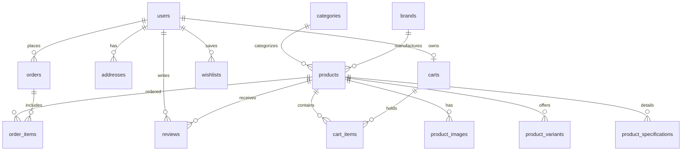

# Mobixora — Smart Tech. Better Life.

A modern, premium, production-ready full-stack e-commerce platform built for smartphones, smart devices, and high-performance mobile accessories.

---

## 💎 Brand Identity

- **Brand Name**: Mobixora
- **Tagline**: *"Smart Tech. Better Life."*
- **Aesthetic**: Futuristic, premium technology, deep slate & electric cyber blue accents.
- **Market Focus**: Authenticated PTA-approved smartphones, GaN ultra-fast chargers, wireless ANC earbuds, power banks, smart watches, and military-grade mobile protective gear.
- **Localization**: Pakistani Rupee (PKR) formatting (`Rs. 49,999`), Pakistani provinces, phone number validation, and Cash on Delivery (COD).

---

## 🛠️ Technology Stack

### Frontend
- **Framework**: Next.js 16 (App Router) & React 19
- **Language**: TypeScript
- **Styling**: Tailwind CSS & Lucide Icons
- **State & Context**: Custom AuthContext, CartContext, WishlistContext with session & local storage synchronization
- **Architecture**: Modular reusable components, responsive mobile-first UI, slide-over mobile drawer, interactive quick view modals, and invoice printing.

### Backend
- **Framework**: Python 3.13 + FastAPI
- **ORM & Database**: SQLAlchemy 2.0 with PyMySQL
- **Database Engine**: MySQL 8.0 (`mobixora_db`)
- **Authentication**: JWT (JSON Web Tokens) with `python-jose` and salted `bcrypt` password hashing
- **Data Validation**: Pydantic v2 schemas
- **API Documentation**: Automatic Swagger UI (`/api/docs`) and ReDoc (`/api/redoc`)

---

## 🚀 Key Features

1. **Header & Navigation**:
   - Modern hexagonal circuit logo badge with responsive typography.
   - Live debounced search with instant product suggestion drop-down.
   - Cart counter badge with live total price preview.
   - Wishlist counter badge.
   - Account dropdown with customer profile, orders, addresses, and admin console quick access.
   - Mobile hamburger menu drawer with smooth backdrop blur.

2. **Homepage**:
   - **Hero Section**: *"Everything Your Mobile Needs"* — showcasing flagship devices with direct CTAs.
   - **Featured Categories**: 8 category cards with dynamic routing.
   - **Featured Products**: Loaded in real-time from FastAPI and MySQL.
   - **Best Deals**: Promotional countdown timer, discount badges, and direct add-to-cart.
   - **Popular Brands**: Apple, Samsung, Xiaomi, OnePlus, Google, Vivo, Oppo, Realme, Infinix, Tecno, Anker, Spigen.
   - **New Arrivals**: Dynamically filtered new tech releases.
   - **Why Choose Mobixora**: 100% Original PTA-approved products, Fast delivery, Secure COD, 7-Day returns, and 24/7 technical support.
   - **Customer Reviews**: Verified customer feedback with star ratings.
   - **Newsletter**: Instant subscription with promo coupon incentive.

3. **Shop Page**:
   - Comprehensive filter sidebar (Category, Brand, Price Range, Min Rating, In Stock Only, On Sale / Discounts).
   - Sorting options (Newest, Price Low to High, Price High to Low, Popularity, Highest Rated).
   - Instant search filtering.
   - Pagination controls.
   - Quick View modal on every product card.

4. **Product Details Page**:
   - Large image gallery with thumbnail switcher.
   - Dynamic variant selector (Color, Storage, RAM) with live price adjustment.
   - Quantity selector with stock ceiling validation.
   - Full Smartphone Specifications Table (Display, Resolution, Processor, RAM, Storage, Cameras, Battery, OS, SIM, Charging, Connectivity, etc.).
   - Tabs for Technical Specs, Features, "What's in the Box", Delivery & Returns.
   - Customer Reviews list and "Write a Review" form with star selector.
   - Related products recommendation row.

5. **Shopping Cart**:
   - Full persistence across browser refreshes via session ID and user account.
   - Quantity updates, item removal, and "Save for Later" to wishlist.
   - Live discount coupon code validation (`WELCOME10`, `MOBIXORA500`, `SUPERTECH`, `FLASH20`).
   - Automated nationwide delivery calculation (Free over Rs. 3,000).

6. **Pakistani Checkout**:
   - Pakistani mobile number validation (`03XXXXXXXXX` / `+923XXXXXXXXX`).
   - Province selector (Punjab, Sindh, Khyber Pakhtunkhwa, Balochistan, Islamabad Capital Territory, Gilgit-Baltistan, Azad Jammu & Kashmir).
   - City selector with Pakistani tech hubs.
   - Payment methods: Cash on Delivery (COD), Direct Bank Transfer (IBFT), and Online Card.
   - Immediate unique order number generation (e.g., `ORD-2026-000001`).
   - Automated stock decrement and coupon usage counter.

7. **Order Success & Tracking**:
   - Order receipt page with complete itemized breakdown, estimated arrival date, and print capability.
   - Dedicated `/track-order` page featuring a visual progress timeline:
     `Pending` ➔ `Confirmed` ➔ `Processing` ➔ `Shipped` ➔ `Out for Delivery` ➔ `Delivered`.

8. **Customer Dashboard**:
   - Personal profile management and password modification.
   - Order history with status badges and invoice details modal.
   - One-click order cancellation with automated inventory restoration.
   - Wishlist management with one-click "Move to Cart".
   - Saved multiple delivery addresses.

9. **Admin Panel (`/admin`)**:
   - **Dashboard**: Revenue, order count, registered customer count, catalog size, pending vs delivered orders, and low-stock alerts.
   - **Sales Charts**: Past 7-day revenue trend and order status breakdown.
   - **Product Management**: Full CRUD with image URLs, pricing, variants, and specifications.
   - **Category Management**: Create, edit, and delete store categories.
   - **Brand Management**: Manage official manufacturer partners.
   - **Order Management**: Search, filter by status, update delivery and payment statuses, and view printable invoices.
   - **Customer Management**: Review customers, order counts, lifetime spend, and toggle account activation.
   - **Inventory Management**: Stock level auditing, low stock alerts (&le; 5 units), and inline stock updates.
   - **Coupon System**: Create percentage or fixed PKR discount vouchers with usage limits and minimum spend constraints.

---

## 🔐 Demo Credentials

| Role | Email / Username | Password |
|---|---|---|
| **Administrator** | `admin@mobixora.com` | `admin12345` |
| **Customer** | `customer@example.com` | `customer123` |
| **Customer 2** | `sara.ali@example.com` | `customer123` |

*One-click demo buttons are also provided directly on the Login page for convenience.*

---

## 🏷️ Sample Discount Coupons

- `WELCOME10`: 10% discount (up to Rs. 5,000 off on orders &ge; Rs. 5,000)
- `MOBIXORA500`: Flat Rs. 500 off (on orders &ge; Rs. 2,000)
- `SUPERTECH`: 5% discount (up to Rs. 8,000 off on orders &ge; Rs. 10,000)
- `FLASH20`: 20% discount (up to Rs. 10,000 off on orders &ge; Rs. 15,000)

---

## 💻 Running the Project Locally

### Prerequisites
- Python 3.10+
- Node.js 18+ (Node 24 tested)
- MySQL Server 8.0 running locally on port 3306

### 1. Backend Setup (FastAPI & MySQL)

```bash
cd backend

# Activate Virtual Environment (Windows)
.\venv\Scripts\activate

# Install dependencies (if needed)
pip install -r requirements.txt

# Run database seed script (populates 24+ products, 12 brands, 8 categories, reviews, orders)
python -m app.seed_data

# Start FastAPI server on port 8000
uvicorn app.main:app --host 127.0.0.1 --port 8000 --reload
```
- API Health: `http://127.0.0.1:8000/api/health`
- Swagger UI Docs: `http://127.0.0.1:8000/api/docs`

### 2. Frontend Setup (Next.js 16)

```bash
cd frontend

# Install dependencies (if needed)
npm install

# Run in development mode
npm run dev

# Or build & start production server on port 3000
npm run build
npm run start -- -p 3000
```
- Storefront URL: `http://127.0.0.1:3000`
- Admin Console: `http://127.0.0.1:3000/admin`

---

## 🗄️ Relational Database Schema



---

## © License
&copy; 2026 Mobixora Technologies. All rights reserved.
*Smart Tech. Better Life.*
